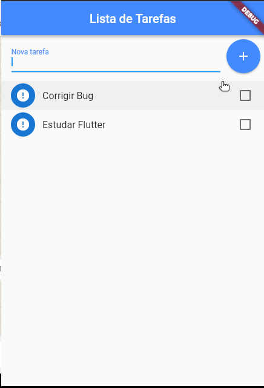

# Flutter Studies

Projects:
 - **01) People Counter**
 
    

    In this project it was studied about:
    * column
    * row
    * vertical and horizontal alignment
    * padding
    * text and formatting
    * button
    * images
    * Stateless and Stateful 

&nbsp;
 - **02) IMC calculate**

    

    In this project was studied about forms and:
    * Scaffold and AppBar
    * Textfield, TextFormField and Decoration
    * ScrolView and TextButton
    * Controllers, Forms and Validators

&nbsp;
 - **03) Currency converter**

    

   In this project was studied about requests, API acess and:
   * Future Build

 - **04) To do List**

    

   In this project was studied about requests, mobile and desktop file access and:
   * Widgets to list
   * Scaffold Messenger
   * Snackbar
   * Refresh indicator

 - **05) Gif searcher**

    

   In this project was studied about:
   * Multiple pages and routes for
   * Split app in multiples files
   